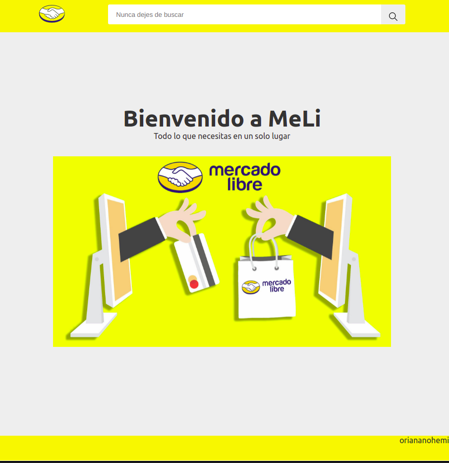
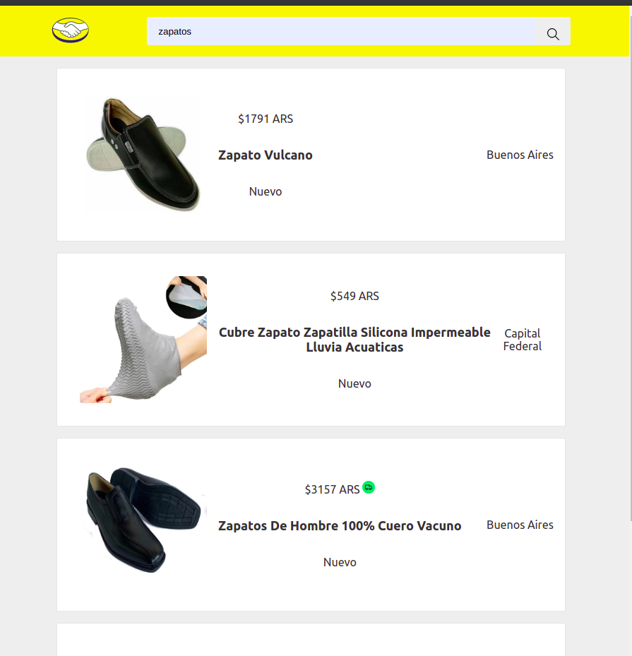
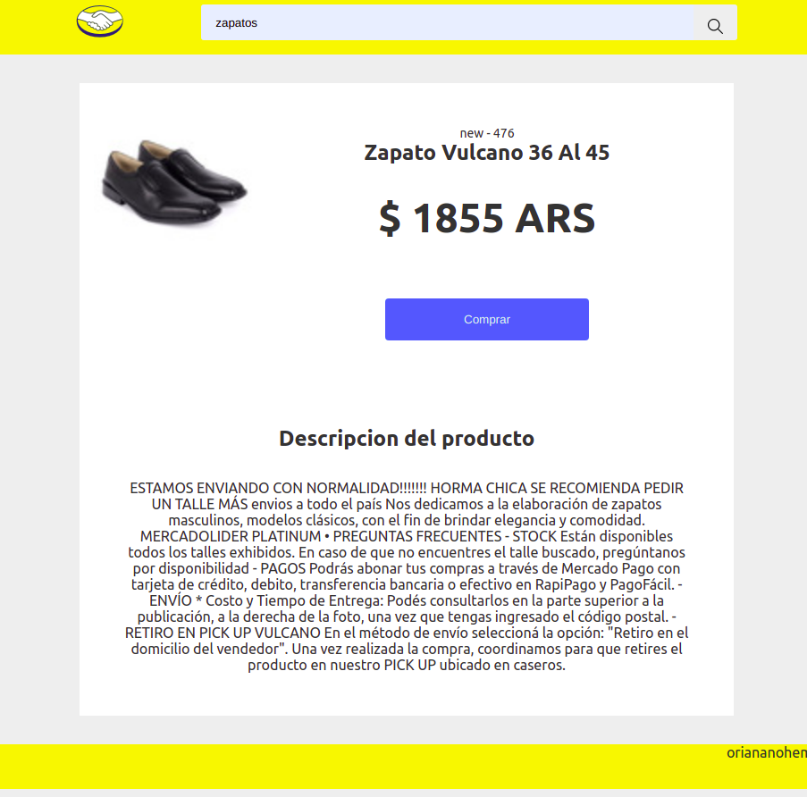

# Meli Store

Tienda virtual Meli, la interfaz fue realizada en [React](https://github.com/facebook/create-react-app), utilizando SCSS. Se desarrollo un servidor con Express y se utilizo la API publica de Mercado Libre

## Proyecto en local

Para probar el proyecto en local, primero clone este repositorio

$ git clone https://github.com/oriananohemi/meli-store

Abra el proyecto dentro de la terminal de su preferencia, luego siga los siguientes comandos

*Para visualizar el frontend*

$ npm install

$ npm start

Se abrira el proyecto en el http://localhost:3000

*Para utilizar el servidor*

La aplicacion esta conectada a un backend deployado en [Heroku](https://sleepy-beyond-89154.herokuapp.com/).En caso de que desee probar el backend en local,
ingrese a la carpeta services del front y en el archivo requestHandler.js cambie la url por http://localhost:3200/api/items y siga los siguientes comandos.

Ingrese a la carpeta server
$ cd server

$ npm install

$ npm start

Su servidor funcionara en el puerto 3200, dicho puerto es configurable.

## Endpoints

Los endpoints pueden ser consultados desde el frontend o desde una herramienta de testeo de peticiones como postman.

GET /api/items?q=:query. Consultar una lista de productos dada una palabra clave

GET /api/items:id. Consultar la informacion de un producto.

GET /api/items:id/description. Consultar el detalle de un producto, parrafo propuesto por el vendedor para explicar las caracteristicas del producto

## Demo del proyecto

[Demo](https://oriananohemi.github.io/meli-store/)

 
 
 
